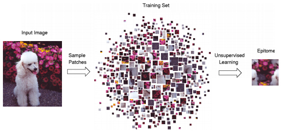

# Epitome Transform Coding: Towards Joint Compression of a Set of Images

## Overall Framework of Our Approach

- Learning the epitome $E$ of a collection of images $I_i$ ${I_i }$, and doing the reconstruction via $E$ and the associated transform map ${\Psi_i}$.

- Then the bitstream of entropy-encoded epitome, transform maps, and residuals, can be transmitted with bandwidth saving and economic storage.

- Last, the transmitted bitstream will be decoded for the final rendering.

## Epitome Learning and Reconstruction

### What is the Epitome?

> See the paper [Learning the “Epitome” of an Image](https://pdfs.semanticscholar.org/2489/2dd2e8ebaede2de24fe04531257b52a908c1.pdf?_ga=2.181265838.828757166.1580261261-1387603277.1535584013) for the details.

- An epitome is a condensed image of parameters that specifies a generative model of patches taken from
input images. 

- It contains high-order statistics of the texture and shape properties of the input images.

- A epitome in size $W_e \times H_e$ can be viewed as a mixture of $W_e \cdot H_e$ Gaussians.

### Epitome Learning

- The epitome is learned so that if small patches are sampled in an unordered fashion from it, they will have nearly the same appearance as patches sampled from the original input image.
  

### Transform Map Encoding

### Residual Processing and Encoding
