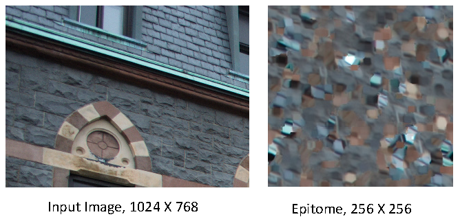
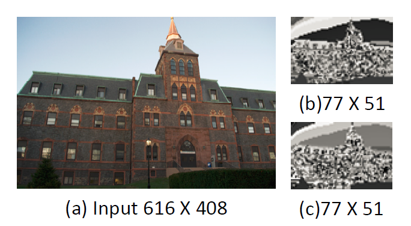
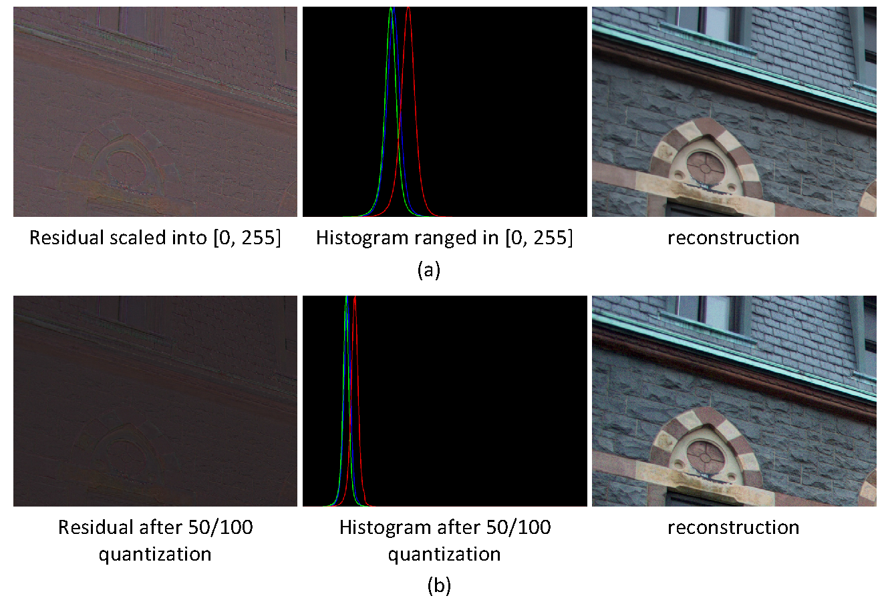
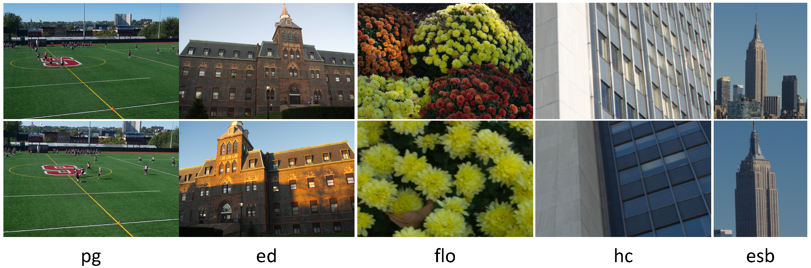
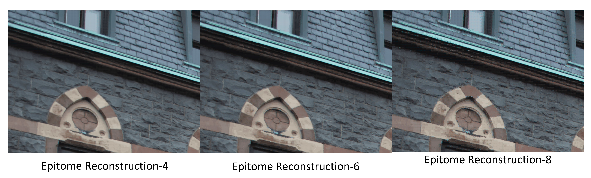
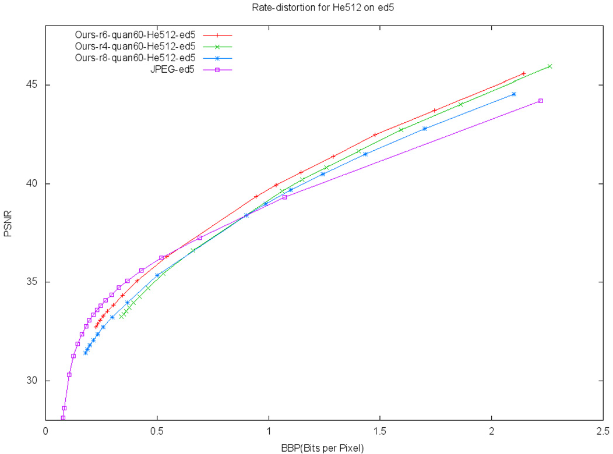
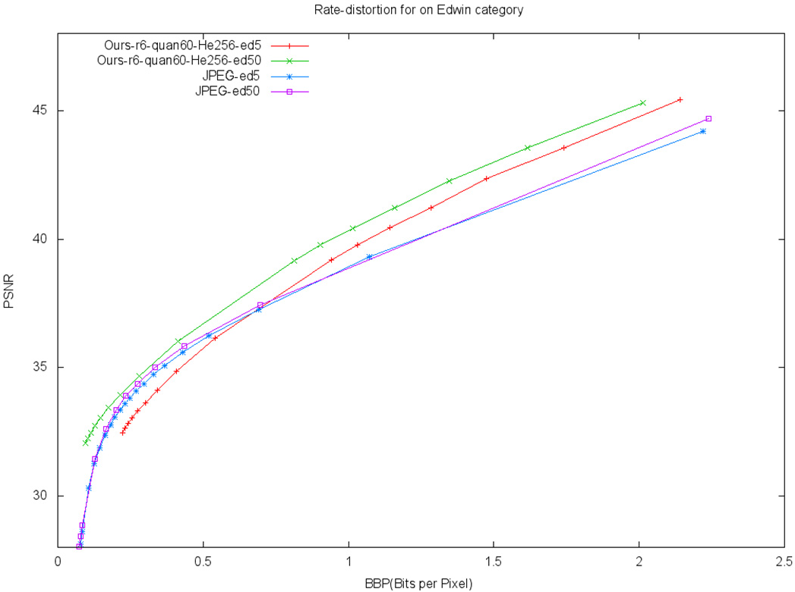

# Epitome Transform Coding: Towards Joint Compression of a Set of Images

## Overall Framework of Our Approach

- Learning the epitome $E$ of a collection of images $I_i$ ${I_i }$, and doing the reconstruction via $E$ and the associated transform map ${\Psi_i}$.

- Then the bitstream of entropy-encoded epitome, transform maps, and residuals, can be transmitted with bandwidth saving and economic storage.

- Last, the transmitted bitstream will be decoded for the final rendering.

## Epitome Learning and Reconstruction

### What is the Epitome?

> See the paper [Learning the “Epitome” of an Image](https://pdfs.semanticscholar.org/2489/2dd2e8ebaede2de24fe04531257b52a908c1.pdf?_ga=2.181265838.828757166.1580261261-1387603277.1535584013) for the details.

- An epitome is a condensed image of parameters that specifies a generative model of patches taken from
input images. 

- It contains high-order statistics of the texture and shape properties of the input images.

- A epitome in size `W x H` can be viewed as a mixture of `W*H` Gaussians.

### Epitome Learning

- The epitome is learned so that when small patches are sampled in an unordered fashion from it, they will have nearly the same appearance as patches sampled from the original input image.

  

- In our study, the inputs and the learned epitome is shown below.

  

### Transform Map Encoding

The transform maps, consisting of column indices shown in fig-(b), and row indices shown in fig-(c), are spatially redundant and similar to the input image shown in fig-(a).

  

### Residual Processing and Encoding
- Residual is the difference between the input images and the epitomic reconstructions.
- To encode and compress the residual is important to achieve large compression ration, as well as high reconstruction quality.
- Thresholding and quantizing are involved.

  

## Dataset and Experimental Results

- Dataset: Images are shot by myself on the campus at Stevens Institute of Technology.

  

- Qualitative Result:

  

- Quantitative Result:

  
  

